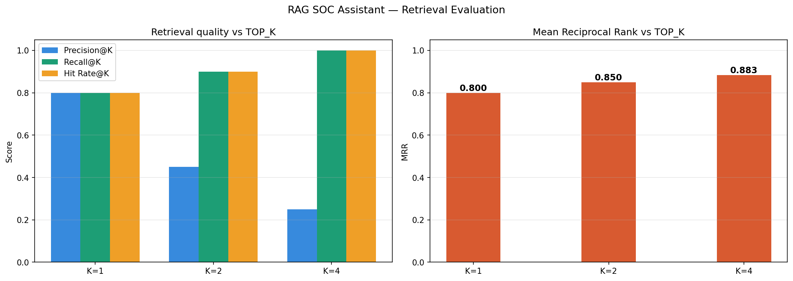
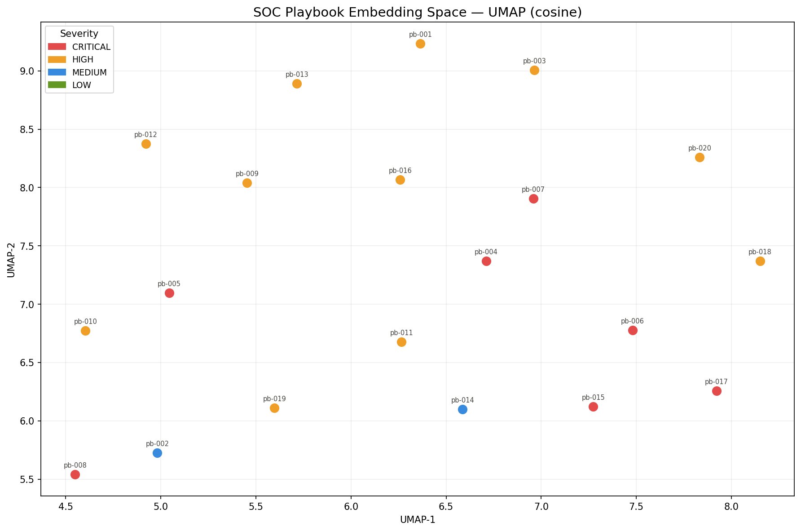
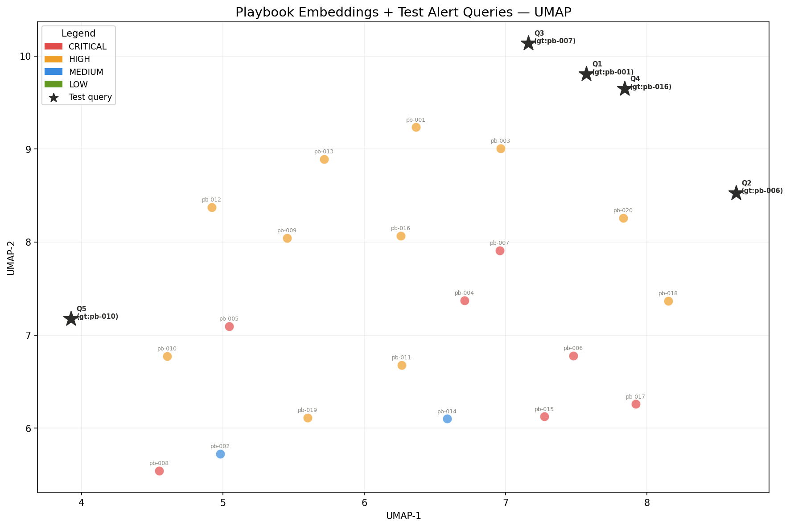

# RAG SOC Assistant

A local, offline **Security Operations Centre (SOC) assistant** powered by Retrieval-Augmented Generation (RAG). Paste a raw alert log or JSON event and the system retrieves relevant playbooks from a vector store, then generates a structured triage report — attack type, severity, MITRE ATT&CK mapping, mitigation steps, and detection recommendations.

Everything runs locally: no API keys, no cloud dependencies.

---

## Architecture

```
Alert (text / JSON)
    │
    ▼
React SOC Dashboard (Vite + CSS Modules)
    │
    ▼
FastAPI REST API
    │
    ├─► Embed (nomic-embed-text via Ollama)
    │       │
    │       ▼
    │   Vector Search (ChromaDB — cosine similarity)
    │       │
    │       ▼
    │   Top-K Candidates retrieved
    │       │
    │       ▼ [optional]
    │   Cross-Encoder Reranking (sentence-transformers)
    │       │
    │       ▼
    │   Top-K Reranked Playbooks
    │
    └─► LLM Generation (llama3 via Ollama — with JSON retry)
            │
            ▼
    Structured JSON triage report
```

---

## Stack

| Layer | Choice | Reason |
|---|---|---|
| LLM | Ollama (local) | No API key, fully offline |
| Default model | `llama3` | Swappable via UI dropdown or request body |
| Embedding model | `nomic-embed-text` | Via Ollama, no external dependency |
| Reranker | `cross-encoder/ms-marco-MiniLM-L-6-v2` | Two-stage RAG precision improvement |
| Vector store | ChromaDB (persistent) | Zero config, file-based |
| Similarity metric | Cosine | Set at collection creation |
| REST API | FastAPI + Uvicorn | Async, auto-docs, Pydantic v2 validation |
| Frontend | React 18 + Vite | CSS Modules, no UI library |
| Language | Python 3.11+ | — |

---

## Knowledge Base

20 playbooks covering the full MITRE ATT&CK kill chain:

| ID | Title | Severity | MITRE Technique |
|---|---|---|---|
| pb-001 | SSH Brute Force Attack | HIGH | T1110.001 |
| pb-002 | Port Scanning / Reconnaissance | MEDIUM | T1046 |
| pb-003 | Phishing / Credential Harvesting | HIGH | T1566.002 |
| pb-004 | Privilege Escalation Attempt | CRITICAL | T1548 |
| pb-005 | Data Exfiltration | CRITICAL | T1041 |
| pb-006 | Malware / Ransomware Execution | CRITICAL | T1486 |
| pb-007 | Lateral Movement via Pass-the-Hash | CRITICAL | T1550.002 |
| pb-008 | Command and Control (C2) Beacon | CRITICAL | T1071.001 |
| pb-009 | Insider Threat / Abnormal Data Access | HIGH | T1078 |
| pb-010 | DNS Tunneling | HIGH | T1071.004 |
| pb-011 | Web Application SQL Injection | HIGH | T1190 |
| pb-012 | Unauthorized Cloud Storage Access | HIGH | T1530 |
| pb-013 | Account Takeover / Credential Stuffing | HIGH | T1110.004 |
| pb-014 | Cryptomining / Resource Hijacking | MEDIUM | T1496 |
| pb-015 | Zero-Day Exploit Attempt | CRITICAL | T1203 |
| pb-016 | Active Directory Kerberoasting | HIGH | T1558.003 |
| pb-017 | Container Escape Attempt | CRITICAL | T1611 |
| pb-018 | Supply Chain / Dependency Confusion | HIGH | T1195.001 |
| pb-019 | DDoS / Volumetric Attack | HIGH | T1498 |
| pb-020 | Exposed Credentials in Source Code | HIGH | T1552.001 |

Each playbook uses the following schema in `data/playbooks.json`:

```json
{
  "id":             "pb-001",
  "title":          "SSH Brute Force Attack",
  "severity":       "HIGH",
  "mitre_technique": "T1110.001",
  "mitre_tactic":   "Credential Access",
  "description":    "...",
  "indicators":     ["..."],
  "detection_rule": "...",
  "response_steps": ["..."]
}
```

---

## Project Structure

```
rag-soc-assistant/
├── data/
│   └── playbooks.json              ← 20 security playbooks (knowledge base)
├── chroma_store/                   ← Auto-generated ChromaDB vector store (git-ignored)
├── ingest.py                       ← Embeds playbooks into ChromaDB (run once)
├── rag.py                          ← Core RAG pipeline (embed → retrieve → generate)
├── models.py                       ← Pydantic request/response schemas
├── api.py                          ← FastAPI REST API
├── requirements.txt
├── pyrightconfig.json
├── eval/
│   ├── labelled_alerts.json        ← 20 ground-truth labelled test alerts
│   ├── evaluate.py                 ← Retrieval metrics: P@K, R@K, MRR, Hit Rate
│   ├── reranker.py                 ← Cross-encoder two-stage retrieval
│   ├── results.json                ← Auto-generated by evaluate.py
│   ├── embedding_space_severity.png
│   ├── embedding_space_with_queries.png
│   └── retrieval_metrics.png
├── notebooks/
│   ├── 01_embedding_space.ipynb    ← UMAP visualisation of playbook embeddings
│   └── 02_retrieval_evaluation.ipynb ← Metric charts and per-alert breakdown
├── tests/
│   ├── test_rag.py                 ← Unit tests for RAG pipeline
│   └── test_api.py                 ← Integration tests for FastAPI endpoints
└── frontend/
    ├── src/
    │   ├── App.jsx
    │   ├── api.js
    │   ├── index.css
    │   ├── main.jsx
    │   └── components/
    │       ├── Topbar.jsx
    │       ├── Sidebar.jsx
    │       ├── AlertInput.jsx
    │       ├── TriageReport.jsx
    │       └── HealthPanel.jsx
    ├── package.json
    └── vite.config.js
```

---

## Setup

### Prerequisites

- Python 3.11 or 3.12 (recommended — avoids numpy build issues on 3.14)
- Node.js 18+
- [Ollama](https://ollama.com) installed and running

### 1. Clone and create virtual environment

```bash
git clone https://github.com/vpadival/rag-soc-assistant.git
cd rag-soc-assistant
py -3.12 -m venv .venv
.venv\Scripts\activate        # Windows
# source .venv/bin/activate   # macOS/Linux
```

### 2. Install dependencies

```bash
pip install -r requirements.txt --only-binary=:all:
```

### 3. Pull required Ollama models

```bash
ollama pull llama3
ollama pull nomic-embed-text
```

### 4. Ingest playbooks into ChromaDB

```bash
python ingest.py
```

Run once, or whenever `data/playbooks.json` is updated.

### 5. Start the API server

```bash
uvicorn api:app --port 8000
```

### 6. Start the frontend

```bash
cd frontend
npm install
npm run dev
# Open http://localhost:5173
```

---

## Usage

### React Dashboard

Open **http://localhost:5173** with both `ollama serve` and the FastAPI server running.

- Paste any raw alert log, JSON event, or plain-text description into the input pane
- Select a model from the dropdown (populated from your live Ollama instance)
- Hit **ANALYZE** or press `Ctrl+Enter`
- The triage report renders on the right with severity, MITRE mapping, explanation, and numbered mitigation steps
- Click any playbook in the sidebar to pre-fill a template query
- Query history persists across page refreshes

**Accepted alert formats:**

Plain English:
```
Multiple failed SSH login attempts from IP 45.33.32.156 targeting root. 87 attempts in 2 minutes.
```

Raw log line:
```
Jan 15 03:22:11 webserver sshd[1234]: Failed password for root from 45.33.32.156 port 4821 ssh2
```

JSON event:
```json
{
  "timestamp": "2024-01-15T03:22:11Z",
  "event_type": "authentication_failure",
  "source_ip": "45.33.32.156",
  "attempts": 87,
  "protocol": "SSH"
}
```

### CLI — single query

```bash
python rag.py --query "Multiple SSH failures from 45.33.32.156 targeting root"
python rag.py --query "..." --model mistral
```

### CLI — interactive REPL

```bash
python rag.py
```

### REST API

Interactive docs: **http://localhost:8000/docs**

#### Endpoints

| Method | Path | Description |
|---|---|---|
| `POST` | `/analyze` | Run RAG pipeline on an alert string |
| `GET` | `/health` | Check Ollama + ChromaDB status |
| `GET` | `/playbooks` | List all playbooks in the knowledge base |
| `POST` | `/ingest` | Re-embed playbooks into ChromaDB on demand |

#### Example — analyze an alert

```bash
curl -X POST http://localhost:8000/analyze \
  -H "Content-Type: application/json" \
  -d '{"alert": "Ransomware detected on workstation — mass file rename events observed"}'
```

**Response:**

```json
{
  "alert": "Ransomware detected on workstation — mass file rename events observed",
  "model_used": "llama3",
  "retrieved_playbooks": [
    { "id": "pb-006", "title": "Malware / Ransomware Execution", "severity": "CRITICAL", "distance": 0.084 }
  ],
  "analysis": {
    "attack_type": "Ransomware",
    "severity": "CRITICAL",
    "explanation": "Mass file rename events indicate active ransomware encryption...",
    "mitigation": ["Immediately isolate infected host from network", "..."],
    "detection_recommendation": "Alert on >100 file rename events per minute from single process",
    "mitre_attack": "T1486 - Data Encrypted for Impact"
  }
}
```

---

## Evaluation

Run retrieval evaluation across TOP_K ∈ {1, 2, 4} against the 20 labelled test alerts:

```bash
python eval/evaluate.py -k 1 -k 2 -k 4
```

Outputs a metrics table and saves `eval/results.json`.

### Results

| K | Precision@K | Recall@K | MRR | Hit Rate@K | Severity Acc |
|---|---|---|---|---|---|
| 1 | 0.80 | 0.80 | 0.80 | 0.80 | 0.90 |
| 2 | 0.45 | 0.90 | **0.85** | 0.90 | 0.90 |
| 4 | 0.25 | **1.00** | 0.88 | **1.00** | 0.90 |

TOP_K=2 is the default — best MRR (0.85) with strong recall (0.90). Perfect recall is achieved at K=4 but precision drops, which is expected when casting a wider retrieval net.

### Retrieval Metrics Chart



### Embedding Space (UMAP)

Playbook embeddings projected to 2D — similar attack types cluster together, confirming the embedding model understands security context.



Test alert queries overlaid — each star lands close to its ground truth playbook.



### Metrics

| Metric | Description |
|---|---|
| Precision@K | Fraction of retrieved playbooks that are relevant |
| Recall@K | Fraction of relevant playbooks that were retrieved |
| MRR | Mean Reciprocal Rank of first relevant hit |
| Hit Rate@K | Fraction of queries with ≥1 correct hit |
| Severity Acc | Fraction where top hit matches ground truth severity |

### Notebooks

```bash
cd notebooks
jupyter notebook
```

- **01_embedding_space.ipynb** — UMAP 2D projection of playbook embeddings coloured by severity; overlays test query positions
- **02_retrieval_evaluation.ipynb** — Bar charts of P@K / R@K / MRR across TOP_K values; per-alert hit/miss breakdown

### Two-Stage Reranking

The cross-encoder reranker improves precision by rescoring bi-encoder candidates:

```bash
python eval/reranker.py
```

Or use it in code:

```python
from eval.reranker import retrieve_reranked
hits = retrieve_reranked(query, collection, top_k=2)
```

---

## Tests

```bash
pytest tests/ -v
```

22 tests, all passing.

- `tests/test_rag.py` — unit tests for parse_response, build_prompt, retrieve, generate, run_query retry logic
- `tests/test_api.py` — FastAPI integration tests for all endpoints (mocked Ollama + ChromaDB)

---

## Configuration

**Swap the LLM model** — select from the dropdown in the UI, or pass `"model"` in the request body:

```bash
curl -X POST http://localhost:8000/analyze \
  -H "Content-Type: application/json" \
  -d '{"alert": "Suspicious outbound transfer detected", "model": "mistral"}'
```

**Add playbooks** — edit `data/playbooks.json` using the schema above and re-run `python ingest.py`.

**CORS** — `api.py` restricts origins to `http://localhost:5173` by default. Update `ALLOWED_ORIGINS` before any deployment.

---

## Notes

- `chroma_store/` is git-ignored — run `python ingest.py` after cloning
- The frontend connects directly to `http://localhost:8000` — change `API_BASE` in `frontend/src/api.js` if needed
- Playbooks with cosine distance > 0.5 are flagged as weak matches in the UI
- The LLM generation step includes one automatic JSON-parse retry with a stricter system prompt before returning a 422
- Use `--only-binary=:all:` when installing on Windows to avoid C compiler errors from source builds